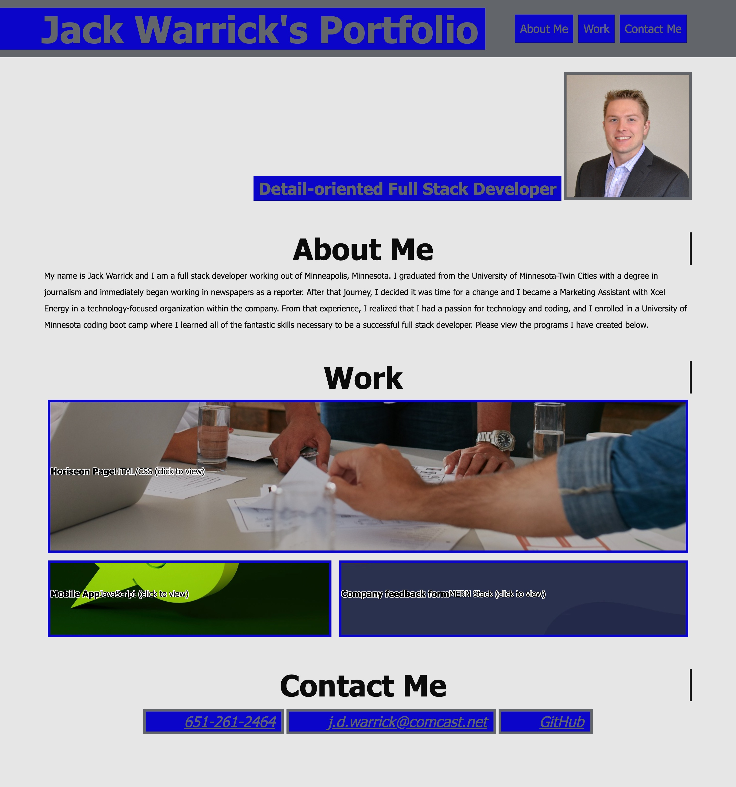

# Module-2-Challenge
This is a repository for the Module 2 Challenge, where the idea was for students to create a portfolio to send to potential employers.

# Description

This portfolio contains the HTML, CSS and image files for Jack Warrick's personal work portfolio. 

When the index.html file is opened, the viewer should see the developer's name, a recent photo of the developer, and header links at the top directing the viewer to three sections: "About Me", "Work", and "Contact Me". These links, when clicked, scroll down to the corresponding sections. 

In the "Work" section, the developer's first application (Horiseon web page) shows up as a larger image than the other two projects below.

When the viewer clicks on the application pictures, they are taken to the deployed applications. And lastly, the content is responsive and changes to adapt to when a screen is enlarged or shrunk.

# Application Materials

Screenshot of what the finished application should look like:

[Link to deployed application](https://jackwarrick.github.io/Module-2-Challenge/)

# Authors
Jack Warrick